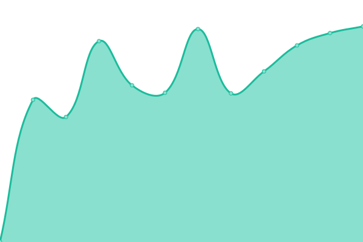

# [📈 Live Status](https://status.tanssi.net): <!--live status--> **🟩 All systems operational**

<!--start: status pages-->
<!-- This summary is generated by Upptime (https://github.com/upptime/upptime) -->
<!-- Do not edit this manually, your changes will be overwritten -->
<!-- prettier-ignore -->
| URL | Status | History | Response Time | Uptime |
| --- | ------ | ------- | ------------- | ------ |
|  [tanssi.net](https://tanssi.net) | 🟩 Up | [tanssi-net.yml](https://github.com/tanssinet/up/commits/HEAD/history/tanssi-net.yml) | 

 869ms
     
 | 

<a href="https://status.tanssi.io/history/tanssi-net">100.00%</a>
    

<!--end: status pages-->

[**Visit our status website →**](https://status.tanssi.io/)

- Powered by: [Upptime](https://github.com/upptime/upptime)
