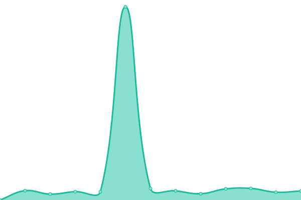
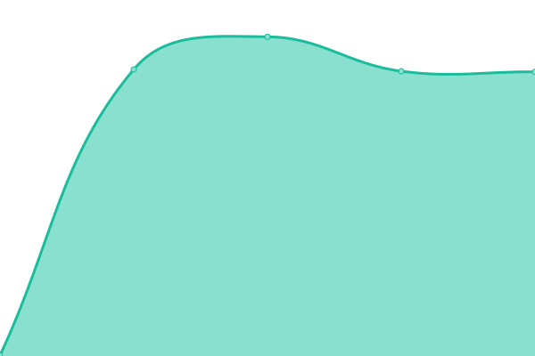
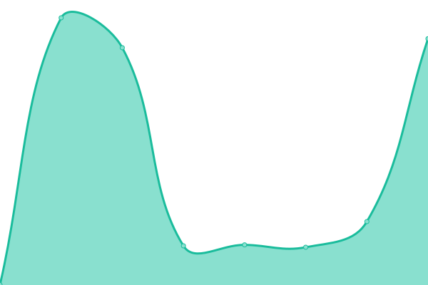

# [📈 Live Status](https://status.tanssi.net): <!--live status--> **🟩 All systems operational**

<!--start: status pages-->
<!-- This summary is generated by Upptime (https://github.com/upptime/upptime) -->
<!-- Do not edit this manually, your changes will be overwritten -->
<!-- prettier-ignore -->
| URL | Status | History | Response Time | Uptime |
| --- | ------ | ------- | ------------- | ------ |
|  [Kalenteri](https://tanssi.net/cal/events/2024/4/16/) | 🟩 Up | [kalenteri.yml](https://github.com/tanssinet/up/commits/HEAD/history/kalenteri.yml) | 

 520ms
     
 | 

<a href="https://status.tanssi.io/history/kalenteri">100.00%</a>
    

|  [Esiintyjät](https://tanssi.net/cal/performers/) | 🟩 Up | [esiintyjaet.yml](https://github.com/tanssinet/up/commits/HEAD/history/esiintyjaet.yml) | 

 500ms
     
 | 

<a href="https://status.tanssi.io/history/esiintyjaet">100.00%</a>
    

|  [Tapahtumapaikat](https://tanssi.net/cal/venues/) | 🟩 Up | [tapahtumapaikat.yml](https://github.com/tanssinet/up/commits/HEAD/history/tapahtumapaikat.yml) | 

 439ms
     
 | 

<a href="https://status.tanssi.io/history/tapahtumapaikat">100.00%</a>
    

<!--end: status pages-->

[**Visit our status website →**](https://status.tanssi.io/)

- Powered by: [Upptime](https://github.com/upptime/upptime)
